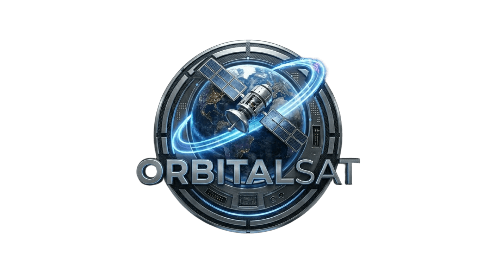

# 🛰️ Simulador de Satélite Virtual
> **Projeto desenvolvido em MATLAB para simulação de órbitas LEO.**

  

---

## 📺 Demonstração Online
Assista ao simulador em ação. O vídeo demonstra a renderização 3D da Terra e o cálculo do *footprint* em tempo real.

  <video width="100%" height="auto" controls poster="orbitalsatlogo.png">
    <source src="VID-20260413-WA0005_1.mp4" type="video/mp4">
    O seu navegador não suporta a visualização de vídeos.
  </video>

---

## 🚀 Sobre o Projeto
Este simulador foi criado para visualizar a **Dinâmica Orbital** de satélites de baixa órbita.

### 🛠️ Especificações Técnicas
* **Motor de Gráficos:** MATLAB 3D Engine.
* **Texturas:** Topografia terrestre de alta resolução com iluminação dinâmica.
* **Cálculos:** Simulação de órbitas LEO com parâmetros de inclinação ajustáveis.
* **Projeção:** Algoritmo de cobertura de solo (*footprint*) em tempo real.

---

## 💻 Como Executar localmente
Se desejas explorar o código fonte e alterar os parâmetros orbitais:

1. Clone o repositório ou baixe o ficheiro `orbitalsat.m`.
2. Abra o ambiente **MATLAB** (Desktop ou Online).
3. Execute o script principal.

---

  Desenvolvido por <b>jplgoncalves</b>

